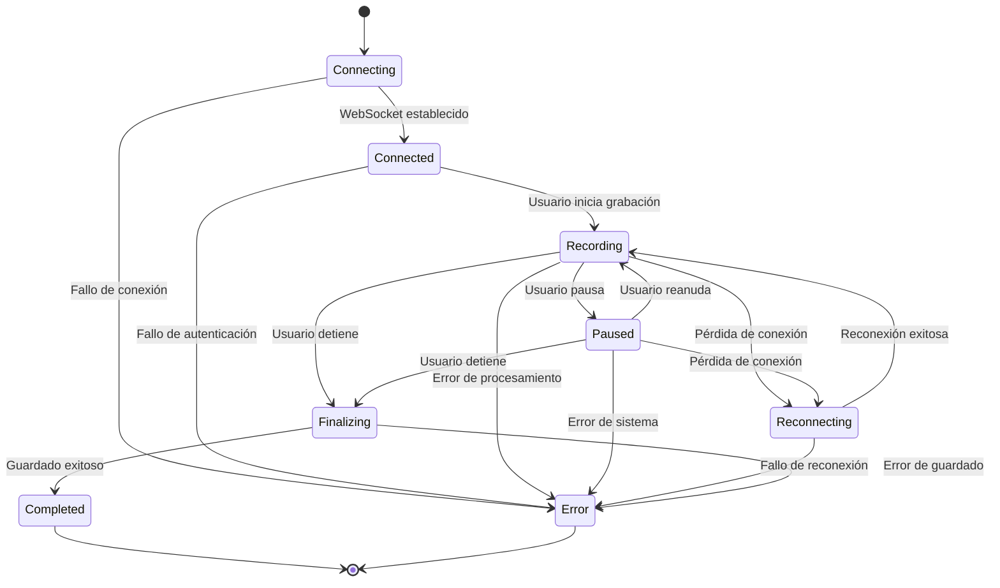
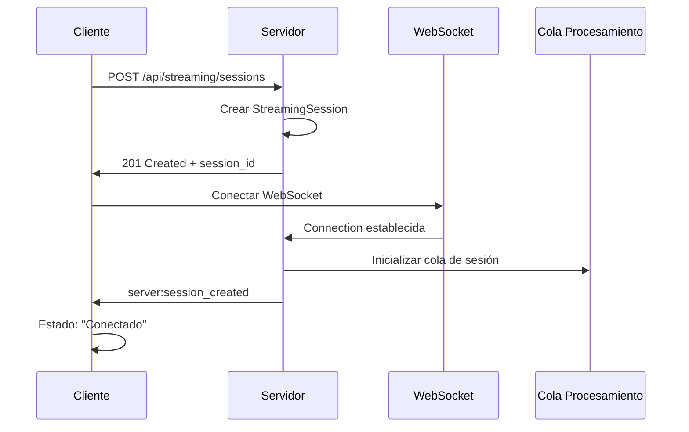
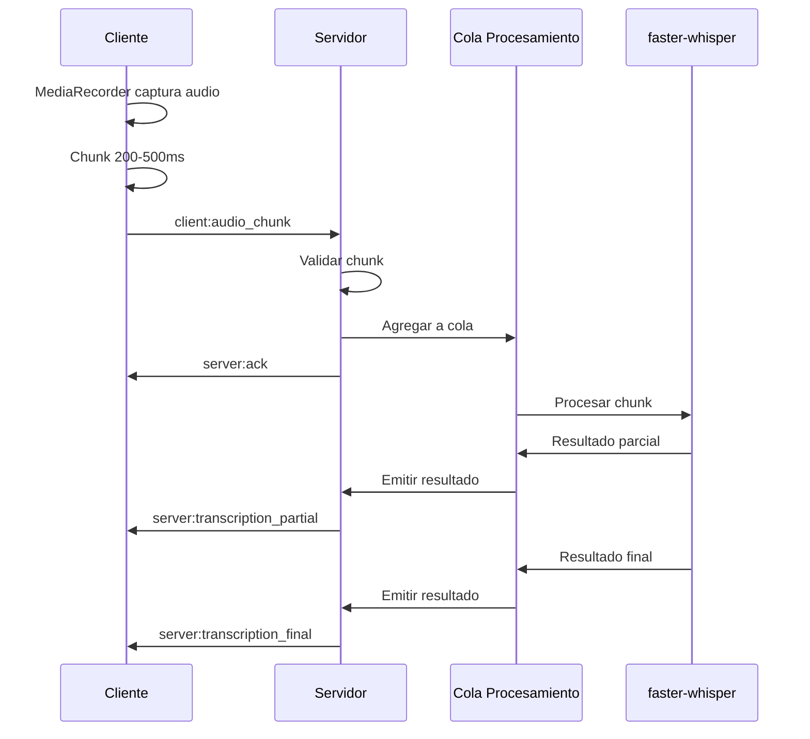
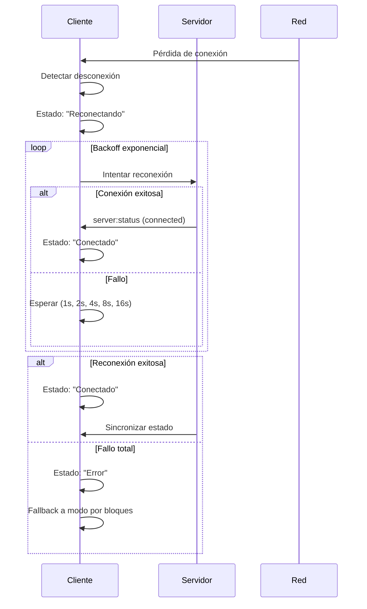
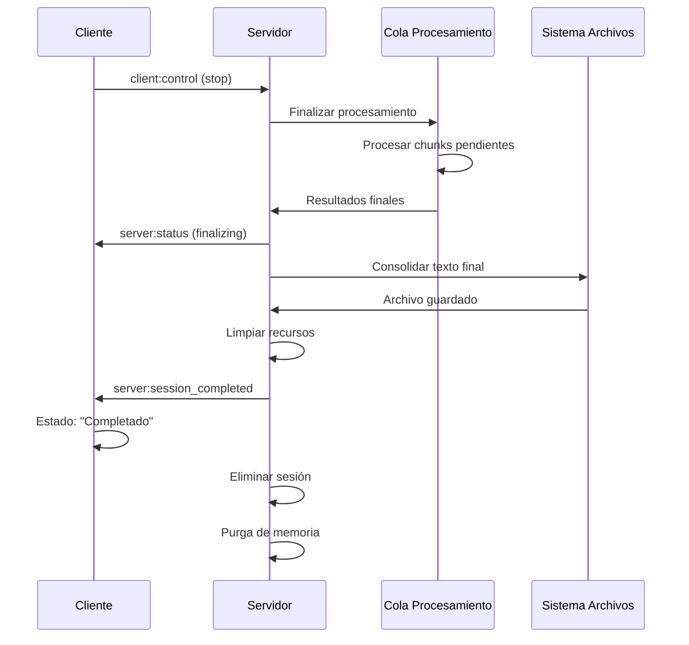

# Streaming Lifecycle: Transcripción en Tiempo Real

**Feature**: Transcripción en Streaming (Tiempo Real)  
**Date**: 2025-01-27  
**Branch**: `003-a-ade-transcripci`

## Diagrama de Estados



## Secuencia de Eventos

### 1. Inicio de Sesión



### 2. Grabación de Audio



### 3. Reconexión Automática



### 4. Finalización de Sesión



## Flujo de Datos

### Captura de Audio (Cliente)

```
Micrófono → MediaRecorder → Chunk (200-500ms) → WebSocket → Servidor
```

**Detalles**:
- Formato: webm/opus
- Frecuencia: 16kHz
- Canales: Mono
- Tamaño: < 1MB por chunk

### Procesamiento (Servidor)

```
WebSocket → Validación → Cola Asíncrona → faster-whisper → Resultado → WebSocket
```

**Detalles**:
- Cola por sesión
- Procesamiento incremental
- Contexto mantenido entre chunks
- Resultados parciales y finales

### Almacenamiento

```
Resultado Final → Consolidación → Archivo Local → Historial
```

**Detalles**:
- Formato: Mismo que transcripciones existentes
- Ubicación: output/transcripcion_timestamp.txt
- Metadatos: Timestamp, duración, latencia promedio

## Manejo de Errores

### Tipos de Error

#### Error de Conexión
- **Causa**: Pérdida de red, servidor inaccesible
- **Acción**: Reconexión automática con backoff
- **Fallback**: Modo por bloques si falla

#### Error de Procesamiento
- **Causa**: faster-whisper falla, audio corrupto
- **Acción**: Reintentar chunk, saltar si persiste
- **Recuperación**: Continuar con siguiente chunk

#### Error de Memoria
- **Causa**: RAM insuficiente, sesión muy larga
- **Acción**: Guardado forzado, limpieza de recursos
- **Prevención**: Límite de 60 minutos, monitoreo de RAM

#### Error de Validación
- **Causa**: Chunk malformado, secuencia incorrecta
- **Acción**: Rechazar chunk, solicitar reenvío
- **Recuperación**: Sincronización de secuencia

### Estrategias de Recuperación

#### Recuperación Automática
- Reconexión con backoff exponencial
- Reintento de chunks fallidos
- Limpieza automática de recursos
- Guardado forzado en límites

#### Recuperación Manual
- Botón de reconexión manual
- Opción de reiniciar sesión
- Fallback a modo por bloques
- Exportación manual de transcripción

## Métricas y Monitoreo

### Métricas en Tiempo Real

#### Latencia
- Medición: Timestamp de envío → Recepción de parcial
- Objetivo: < 2 segundos
- Advertencia: > 3 segundos

#### Rendimiento
- CPU: Uso porcentual
- RAM: Uso en MB
- GPU: Disponibilidad y uso
- Red: Chunks por segundo

#### Calidad
- Confianza de transcripción
- Calidad de audio
- Pérdida de chunks
- Errores de procesamiento

### Alertas Automáticas

#### Latencia Alta
- Trigger: > 3 segundos
- Acción: Advertencia visual, optimización automática

#### Memoria Baja
- Trigger: < 1GB disponible
- Acción: Limpieza de recursos, advertencia

#### Conexión Inestable
- Trigger: Múltiples reconexiones
- Acción: Sugerir modo por bloques

## Optimizaciones

### Optimización de Latencia

#### Cliente
- Chunks pequeños (200-500ms)
- Compresión eficiente (opus)
- Envío asíncrono
- Cache de resultados

#### Servidor
- Procesamiento asíncrono
- Cola optimizada
- Modelo apropiado (base/small)
- GPU cuando disponible

### Optimización de Recursos

#### Memoria
- Buffers limitados
- Purga automática
- Límites de sesión
- Monitoreo continuo

#### CPU
- Procesamiento incremental
- Modelos eficientes
- Paralelización cuando posible
- Throttling inteligente

## Consideraciones de Seguridad

### Validación de Entrada
- UUID de sesión válido
- Tamaño de chunk limitado
- Formato de audio válido
- Secuencia numérica correcta

### Protección de Datos
- No persistencia de audio
- Limpieza automática
- Logs sin contenido sensible
- Conexiones encriptadas (WSS)

### Rate Limiting
- Chunks por segundo
- Sesiones concurrentes
- Reconexiones por sesión
- Límites por IP
